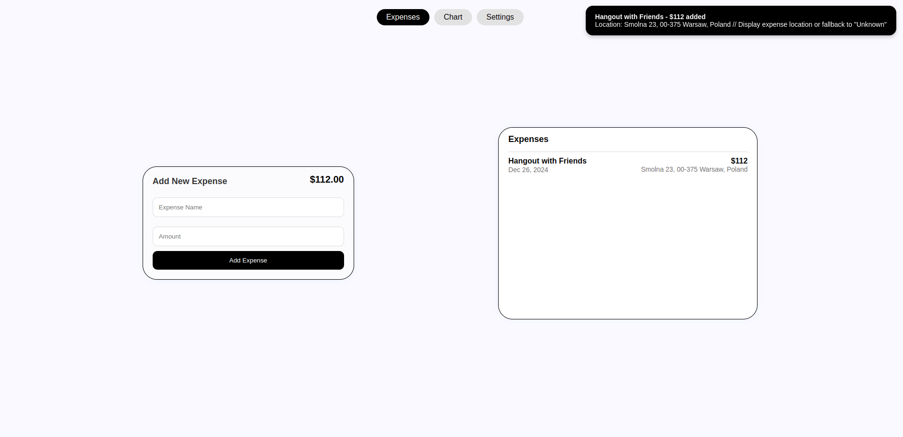
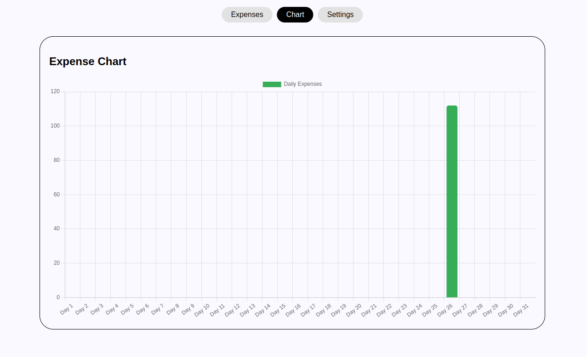
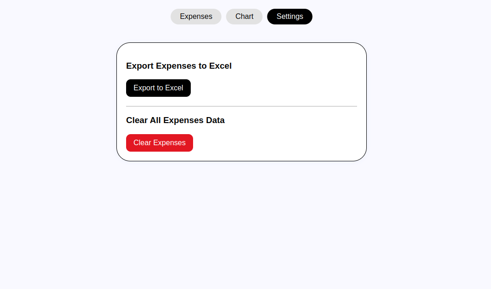

# Expense Tracker App

## Description

This **Expense Tracker** app helps users track their daily expenses, view them on a visually engaging chart, and export their expense records to an Excel file. The application leverages modern web technologies like **React.js**, **Dexie.js** (IndexedDB), and **Chart.js** to provide an interactive experience, along with offline capabilities through a **Progressive Web Application (PWA)** approach. Users can also receive notifications and clear their expenses with a sound effect for added user interaction.


---

## Screenshots
- **Expenses View**


- **Chart View**


- **Settings View**


---

## Features

- **Expense Tracker**: Log and manage daily expenses, including name, amount, date, and location.
- **Expense Chart**: Visualize your expenses through an interactive **Bar Chart** that groups expenses by day of the month.
- **Excel Export**: Export your expense records into an **Excel file** for easy tracking and sharing.
- **Offline Access**: Built as a **Progressive Web Application (PWA)**, allowing offline functionality and installation on your device.
- **Geolocation Support**: Automatically capture the user's location when adding an expense.
- **Notifications**: Receive notifications for each new expense, with the option to play sound and show desktop notifications.
- **Database Management**: Expenses are stored in an **IndexedDB** database (using **Dexie.js**), and you can clear all data with a simple click.
  
---


## Technologies Used

- **React.js**: For building the user interface.
- **Dexie.js**: A minimalistic wrapper for IndexedDB to manage local storage for expenses.
- **Chart.js**: For creating dynamic and responsive charts.
- **PWA Features**: Service Workers, caching strategies, and offline functionality.
- **OpenCage API**: Used for reverse geocoding to get the user's location based on latitude and longitude.
- **Excel Export**: Using the **xlsx** library to export expense data as Excel files.
- **Notifications**: Desktop notifications via browser API and custom UI notifications.
- **Babel** and **Webpack**: For building and bundling the app.

---

## Installation

To run the app locally, follow these steps:

1. Clone the repository:

   ```bash
   git clone https://github.com/your-github-username-nigga/expense-tracker.git

2. Navigate to the project directory:

   ```bash
   cd expense-tracker

3. Install dependencies:

     ```bash
     npm install

4. Start the development server:

     ```bash
     npm start

## The app will be available at 'http://localhost:3000'

# How to Use

## Track Expenses:
- Add an expense by filling out the form with the name, amount, date, and location of the expense.
- Expenses will automatically be grouped by the day of the month and displayed in a bar chart.

## View Your Expenses:
- View the Daily Expenses chart that shows the total expenses for each day.
- The chart dynamically updates when new expenses are added.

## Export Data:
- Click the "Export to Excel" button in the settings to download your expense data as an Excel file.

## Clear Data:
- You can clear all your expenses with the "Clear Expenses" button in the settings. This will reset the data and play a sound for confirmation.

## Offline Use:
- Once installed as a PWA, you can use the app offline, and it will still store your data and provide a seamless experience.

# API Integration
- **OpenCage Geocoding API**: The app uses the OpenCage API to get the user's current location based on latitude and longitude.

# Contributing
1. Fork the repository.
2. Create a feature branch:

     ```bash
     git checkout -b feature/your-feature

3. Commit your changes:

     ```bash
     git commit -m 'Add new feature'

4. Push to the branch:

     ```bash
     git push origin feature/your-feature

5. Create a new Pull Request.

LICENSE: This project is licensed under the MIT License - see the LICENSE file for details.

# Acknowledgments
- **Create React App**: A boilerplate used for building the React app.
- **Dexie.js**: For handling the local database.
- **Chart.js**: For creating beautiful charts.
- **OpenCage Geocoding API**: For fetching location data based on latitude and longitude.

# Customization Instructions
- Replace the `git clone` URL with your actual repository URL.
- Add appropriate screenshots to the `public/` folder and adjust the `![Expense Chart]` image links if you have them.
- Update the **License** section if you're using a different license or include any credits you want to acknowledge.


# expense-tracker

# expense-tracker

